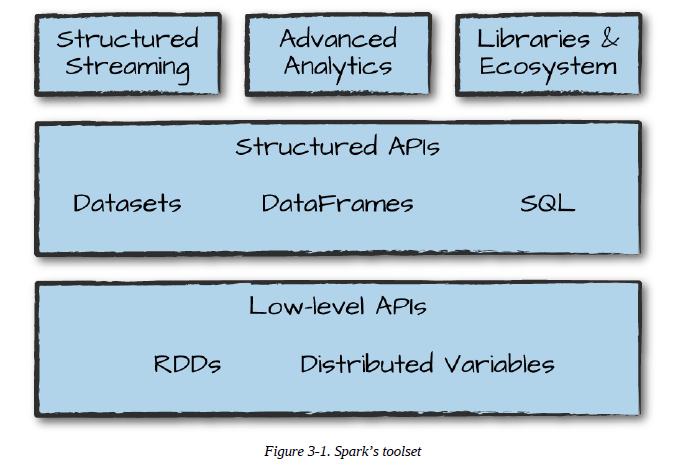

# 스파크 기능 둘러보기 (A Tour of Spark's Toolset)
## 스파크 기본 요소
* 저수준 API
* 구조적 API
* 표준 라이브러리




## ```spark-submit``` 명령
* 대화형 셸에서 개발한 프로그램을 운영용 어플리케이션으로 전환 가능 
* 작업 종료 또는 에러 발생까지 실행
* ```master``` 옵션 값에 따라 스탠드얼론 / 메소스 / YARN 클러스트 매니에서 동일한 어플리케이션 실행
```
./bin/spark-submit \
--master local \
./example/src/main/python/pi.py 10
```

## Dataset
* 정적 타입 언어 지원 (동적 타입 언어인 ```Python```, ```R```에서 지원 안 함)
  * e.g. 정적 타입 언어 ```Java String helloWorld = "Hello World!"``` vs 동적 타입 언어 ```Python hello_world = 'Hello World!'``` 
* DataFrame
  * 표 형태의 데이터를 다룰 수 있는 Row 타입 객체로 구성된 분산 컬렉션
  * 자바 클래스 타입 (사용자 정의 타입), 스칼라 케이스 타입 지원
    * 자동으로 타입 분석해 적합한 스키마 생성
  * 원할 때에만 사용 가능
  * ```collect``` 또는 ```take``` 시 원하는 타입의 객체로 변환해서 반환

> Each Dataset also has an untyped view called a DataFrame, which is a Dataset of Row

```
// Java
// Generic 문법과 유사
Dataset<T>
```

## 구조적 스트리밍
* 스트림 처리용 고수준 API
* 배치 모드 연산 스트리밍 방식으로 실행 가능
    * 배치 vs 스트리밍 ((출처)[https://bcho.tistory.com/1119])
        * 이미 저장되어 있지 않은 데이터를 *UnBounded data*라고 함
        * Unbounded data의 처리 방식에 따라 배치와 스트리밍 구분
        * 배치 
            * Fixed Windows
                * 일정 시간 단위로 데이터를 모은 후 배치로 처리
                * 구현이 간단
                * 실시간성 떨어짐
        * 스트리밍
            * Time agnostic
                * 시간 속성을 갖지 않는 데이터
                * 들어오는 대로 처리
            * Filtering
                * 들어오는 데이터 중 특정 데이터만 저장
            * Windowing
                * 일정 시간 간격으로 처리
            * 기타
* 지연 시간 줄임
* 증분 처리 가능
* ```read``` 대신 ```readStream``` 메소드 사용
* ```maxFilesPerTrigger``` 한 번에 읽을 파일 수 설정
* 스트리밍 액션 
    * 트리거 실행 된 다음 데이터를 갱신하게 될 인메모리 테이블에 데이터 저장
* 파일 데이터에 따라 결과 변경될 수도 있음
* c.f. 셔플 파티션
    * 셔플 이후 생성돌 파티션 수
    * 기본값 200

## 머신러닝과 고급 분석
* MLib
    * 내장된 머신러닝 알고리즘 라이브러리
    * 전처리, 멍잉, 모델 학습 및 예측 가능
* k-평균 예시
    * k-평균
        * 센트로이드 (중심점) 임의로 할당 -> 중심정에 가까운 점 군집에 할당 -> 할당된 점의 중심을 계산
        * 위의 과정을 정해진 횟수만큼 또는 수렴할 때까지 반복
    * 파이프라인 준비 (트랜스포메이션 자동화 (```StringIndexer```) -> 변환자 적합) -> 하이퍼파라미터 튜닝값 적용 -> 모델 관련 인스턴스 생성 후 학습 (모델 초기화 -> 학습)

## 저수준 API
  * RDD
    * ```Spark``` 모든 기능의 기반이 됨
    * 물리적 실행 특성 결정해 세밀한 제어 가능
    * 드라이버 시스템 메모리에 저장된 원시 데이터 병렬처리 가능
    * 스칼라 / 파이썬 모두 사용 가능
        * RDD 동일하진 않음

## SparkR
  * R언어로 Spark 사용
  * 