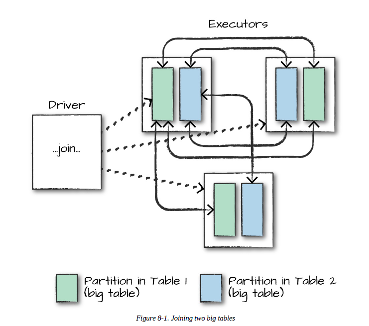
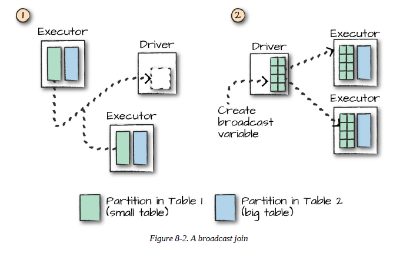

# 조인 (Joins)
* 다양한 데이터셋을 결합할 때 사용


## 조인 표현식
* 하나 이상의 키 값을 비교한 후 데이터셋 결합 여부를 결정
* 지정된 키가 동일한지 비교하는 동등 조인 (equi-join)이 많이 사용됨
* 스파크 다른 조인의 형태도 지원

- - -
* SQL에서 조인은 두 테이블 간에 이루어짐
* 3개 이상의 테이블을 조인할 경우, 두 개 테이블을 조인한 결과 테이블과 나머지 테이블 간 조인이 이루어짐
* 조인이 두 개의 테이블에 대해서 이루어지기 때문에, 조인 순서에 따른 튜닝이 가능
```
-- a와 b를 조인한 결과 테이블과 c를 다시 조인
SELECT a.*, b.*, c.*
FROM table1 a, table2 b, table3 c
``` 
- - -

## 조인 타입
* 이하 참고

## 내부 조인 (Inner Join)
* 조인 표현식이 참으로 평가되는 로우만 결합

## 외부 조인 (Outer Join)
* 기준 컬럼의 값이 조인 테이블의 컬럼에 없을 경우 ```nul``` 삽입

## 왼쪽 외부 조인
* 왼쪽 로우를 기준으로 하는 외부 조인

## 오른쪽 외부 조인 
* 오른쪽 로우를 기준으로 하는 외부 조인

## 왼쪽 세미 조인 (Semi Join)
* 한 테이블의 값이 다른쪽 테이블에 하나 이상 존재할 때 조인 수행
* 기존의 조인과 다른 점은 값이 여러 개 존재하더라도 하나의 행만 조인해 반환
* 필터의 역할 ([출처](https://blog.rackspace.com/speeding-queries-semi-joins-anti-joins-oracle-evaluates-exists-not-exists-not))

## 왼쪽 안티 조인 (Anti Join)
* 한 테이블의 값이 다른쪽 테이블에 존재하지 않을 때 조인 수행 ([출처](https://blog.rackspace.com/speeding-queries-semi-joins-anti-joins-oracle-evaluates-exists-not-exists-not))
* ```NOT EXIST```, ```NOT IN```과 같이 동작

## 자연 조인 (카테시안 조인, Catesian Join)
* 한 테이블의 모든 값을 다른쪽 테이블의 값과 결합

## 조인 사용 시 문제점
* 복합 데이터 타입의 조인
  * ```Boolean``` 반환하는 모든 표현식 조인 표현식으로 간주 가능
* 중복 컬럼명 처리
  * 문자열 또는 시퀀스로 바꿈
  * 조인 후 컬럼 제거
  * 조인 전 컬럼명 변경

## 스파크 조인 수행 방식
* 네트워크 통신 전략에 따라 구분
  * 셔플 조인 (Shuffle Join)
    * 전체 노드 간 통신을 유발
    * 큰 테이블과 다른 큰 테이블 조인 시 발생   
    


  * 브로드캐스트 조인 (Broadcast Join)
    * 단일 워커 노드 메모리 크기에 적합한 정도로 작은 테이블의 경우 최적화 가능
      * 구체적으로 ```spark.sql.autoBroadcastJoinThreshold```보다 작아야 함([출처](https://jaceklaskowski.gitbooks.io/mastering-spark-sql/spark-sql-joins-broadcast.html))
        * ```spark.sql.autoBroadcastJoinThreshold```의 기본값은 ```10L * 1024 * 1024```임 ([출처](https://jaceklaskowski.gitbooks.io/mastering-spark-sql/spark-sql-properties.html#spark.sql.autoBroadcastJoinThreshold))
    * 데이터프레임을 클러스터 전체 워커 노드에 복제 
      * 처음에 대규모 노드 간 통신이 발생하지만 그 이후 추가적으로 통신 발생하지 않음
        * CPU가 병목 구간이 됨
    * 힌트를 통해 ```MAPJOIN```, ```BROADCAST```, ```BROADCASTJOIN``` 설정 가능 ([참고](https://spark.apache.org/docs/latest/sql-performance-tuning.html))  
      * 힌트를 사용하더라도 강제성이 없음      
    

* 아주 작은 테이블 간 조인은 스파크가 조인 방식 결정하는 것이 효율적

- - -
* DBMS의 옵티마이저는 쿼리, 데이터베이스 스키마, 통계 정보를 이용해 최적화된 실행방법인 실행 계획 생성 (Execution Plan)
* 옵티마이저는 최적화 방식에 따라 구분
  * 규칙 기반 옵티마이저
  * 비용 기반 옵티마이저
* 옵티마이저가 생성한 실행 계획은 최적의 경우가 아닐 수 있음
  * 옵티마이징 팩터의 부족
    * 옵티마이저는 도메인에 대한 지식을 보유할 수 없어 최적화에 어려움
  * 통계 정보의 이용
    * 데이터에 대해 전수 조사를 하면 속도가 느려지기 때문에 불가
    * 이에 따라 표본 통계 정보를 이용하는데 표본의 대표성 등에 옵티마이저의 실행 계획이 영향을 받음
  * 히스토그램 버킷 수 254개만 허용
    * 컬럼의 DISTINCT 값이 이를 초과할 경우 빈도 기록 불가 
  * 바인드 변수의 사용
    * 어떤 값이 들어올지 모르기 때문에 균등 분포 가정
* 옵티마이저의 한계를 ```힌트 (Hint)```를 통해서 보완 가능
  * ```access path``` 이용 불가일 경우 무시될 수 있음 ([출처](https://docs.oracle.com/cd/B19306_01/server.102/b14211/hintsref.htm#i8327))
- - -
* DBMS에서 조인 방식
  * Nested Loop Join
  * Sort Merge Join
  * Hash Join
